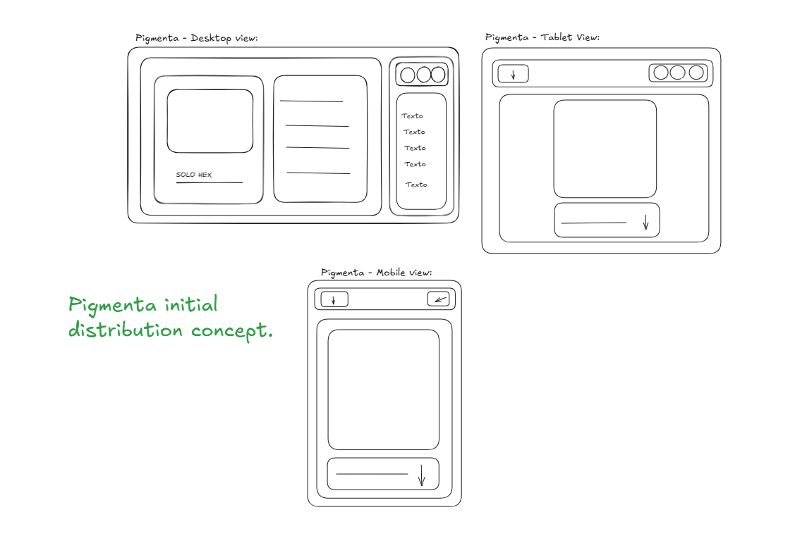
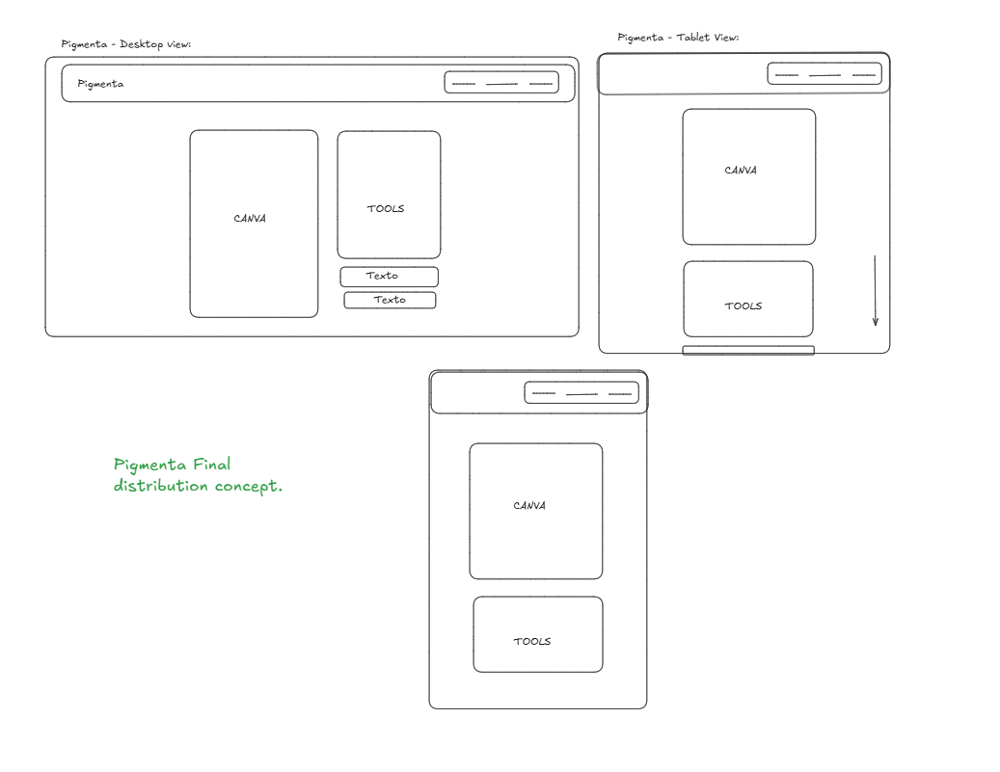

# Pigmenta

[](https://svelte.dev/)
[](https://vitejs.dev/)
[](https://www.typescriptlang.org/)
[](https://tailwindcss.com/)
[](https://www.shadcn-svelte.com/)
[](https://github.com/SrAlexis16/KuantumDashboard/releases)
[](https://github.com/SrAlexis16/KuantumDashboard/projects)

> Herramienta profesional de gestión de color con múltiples vistas especializadas para desarrolladores, diseñadores y artistas

## ¿Qué es Pigmenta?

Pigmenta es una aplicación web modular para selección y gestión avanzada de color. Ofrece tres vistas especializadas con herramientas adaptadas a cada workflow profesional:

- **Artist View**: Rueda de color interactiva para exploración cromática intuitiva
- **Designer View**: Selector cuadrado preciso para control total de saturación y brillo
- **Developer View**: Formatos múltiples y validación de contraste WCAG

## Historia del Proyecto

Pigmenta comenzó como un experimento en **React + Vite** para crear un color picker simple. Sin embargo, a medida que crecía, los problemas de performance se hacían evidentes: conversiones de color en cada render, re-renders innecesarios y una gestión de estado cada vez más compleja.

La decisión de **reescribir desde cero en Svelte** surgió de la necesidad de:

- Eliminar la complejidad de hooks y efectos secundarios
- Aprovechar la reactividad nativa para actualizaciones en tiempo real
- Reducir el código y mejorar la mantenibilidad
- Aprender un paradigma diferente y más eficiente

**Este proyecto representa un caso de estudio de migración React → Svelte** y cómo elegir el stack correcto mejora tanto el código como la experiencia del usuario.

## Características Principales

### Vistas Especializadas

| Vista | Descripción | Casos de Uso |
|-------|-------------|--------------|
| **Artist** | Rueda de color cromática con selección visual | Creación de paletas, armonías, exploración creativa |
| **Designer** |  Rueda de color cromática con formatos técnicos y validación | Teoría del color, mockups, accesibilidad |
| **Developer** | Selector 2D de saturación/brillo | Implementación, ajustes precisos, documentación |

### Módulos de Color (Reutilizables para proximamente una libreria)

- **WheelPicker**: Selector circular con representación completa del espectro HSL
- **SquarePicker**: Selector 2D para ajustes rápidos de saturación y brillo
- **Brightness Slider**: Control preciso de luminosidad
- **Saturation Slider**: Ajuste de intensidad del color
- **Hue Slider**: Selección del matiz en espectro completo
- **ColorSwatch**: Salida del color su respestivo nombre
- **InputHex**: Entrada directa de valores con validación

### Funcionalidades Avanzadas

- **Validador de Contraste WCAG**: Cumplimiento de estándares de accesibilidad AA/AAA
- **Formatos Múltiples**: HEX, RGBA, HSL, CIELAB, CMYK, OKLCH
- **Copia Rápida**: Click para copiar cualquier formato al portapapeles
- **Performance Optimizado**: Reactividad nativa sin virtual DOM
- **Arquitectura Modular**: Componentes desacoplados y reutilizables

## Arquitectura

```
src/
├── lib/
│   ├── components/
│   │   ├── modules/              # Módulos de funcionalidad completa
│   │   │   ├── BrightnessSlider/
│   │   │   ├── ColorSwatch/
│   │   │   ├── HueSlider/
│   │   │   ├── InputHex/
│   │   │   ├── SaturationSlider/
│   │   │   ├── SquarePicker/
│   │   │   └── WheelPicker/      # Nuevo en V2
│   │   └── ui/                   # Componentes UI base (shadcn-svelte)
│   ├── store/                    # Estado global (Svelte stores)
│   └── views/                    # Vistas especializadas
│       ├── artist/               # Vista para artistas
│       ├── designer/             # Vista para diseñadores
│       └── developer/            # Vista para desarrolladores
├── App.svelte                    # Componente raíz
└── main.ts                       # Punto de entrada
```

### Principios de Diseño

- **Modularidad**: Cada componente es independiente y reutilizable
- **Reactividad**: Aprovecha el sistema reactivo nativo de Svelte 5
- **Type Safety**: TypeScript para todo el codebase
- **Separation of Concerns**: Separación clara entre lógica, presentación y estado
- **Performance First**: Optimizaciones desde el diseño inicial

## Instalación

```bash
# Clonar el repositorio
git clone https://github.com/SrAlexis16/KuantumDashboard.git
cd KuantumDashboard

# Instalar dependencias
npm install

# Iniciar servidor de desarrollo
npm run dev
```

El proyecto estará disponible en `http://localhost:5173`

## Aprendizajes Clave

Este proyecto explora:

- **React → Svelte Migration**: Refactorización completa con mejoras de performance del 60%+
- **Svelte 5 Runes**: Sistema reactivo de nueva generación vs hooks de React
- **Arquitectura de Vistas**: Separación de concerns por tipo de usuario
- **Type Safety**: TypeScript avanzado en componentes Svelte
- **Design Systems**: Construcción de sistema de diseño coherente con documentación
- **Gestión de Estado**: Svelte stores vs useState/useContext/Redux

## Roadmap

Para seguir el progreso detallado, consulta el [Pigmenta Roadmap](https://github.com/users/SrAlexis16/projects/2/views/1).

### Próximas Funcionalidades

- [ ] Exportación de paletas (JSON, CSS, SCSS, Tailwind)
- [ ] Historial de colores seleccionados con búsqueda
- [ ] Generador de gradientes (lineal, radial, cónico)

### V2.0.0 - Completado

- Vista Artist con generacion de distintas paletas
- Vista Designer con validador de contraste WCAG AA/AAA
- Arquitectura de vistas especializadas

### V1.0.0 - Base Estable

- Migración completa de React a Svelte
- Sistema de módulos reutilizables
- Múltiples formatos de color
- ColorSwatch e Input hex (escenciales)
- Vista de Developer con ajustes crómaticos precisos

## Recursos
- Boceto de la primera distribución:



- Decisión final de layout:

> Decisión final: se eligió este layout por limitaciones técnicas en breakpoints y para priorizar un diseño responsive más coherente.

---

**Pigmenta V2.0.0** - Vistas especializadas para cada workflow | Arquitectura modular escalable

**/README.md v3.0.0** - Última actualización: Octubre 2025
